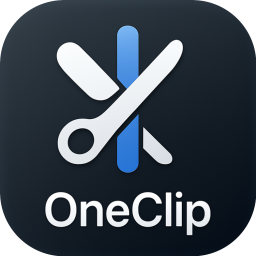
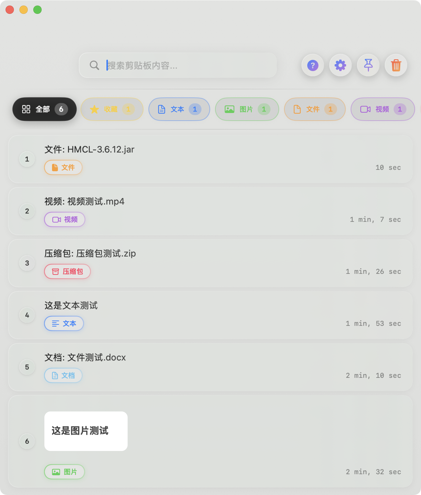
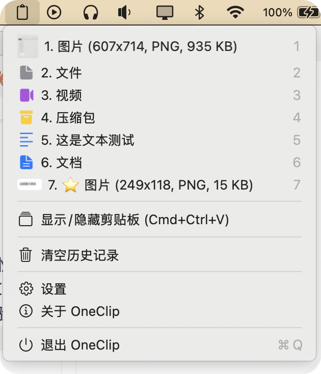
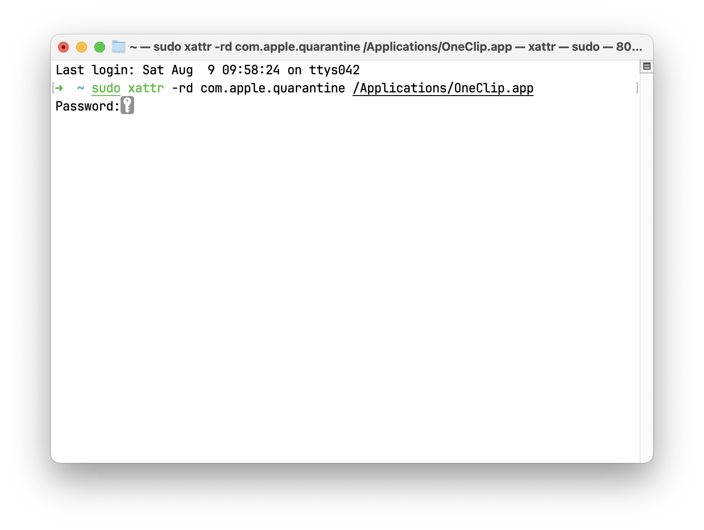
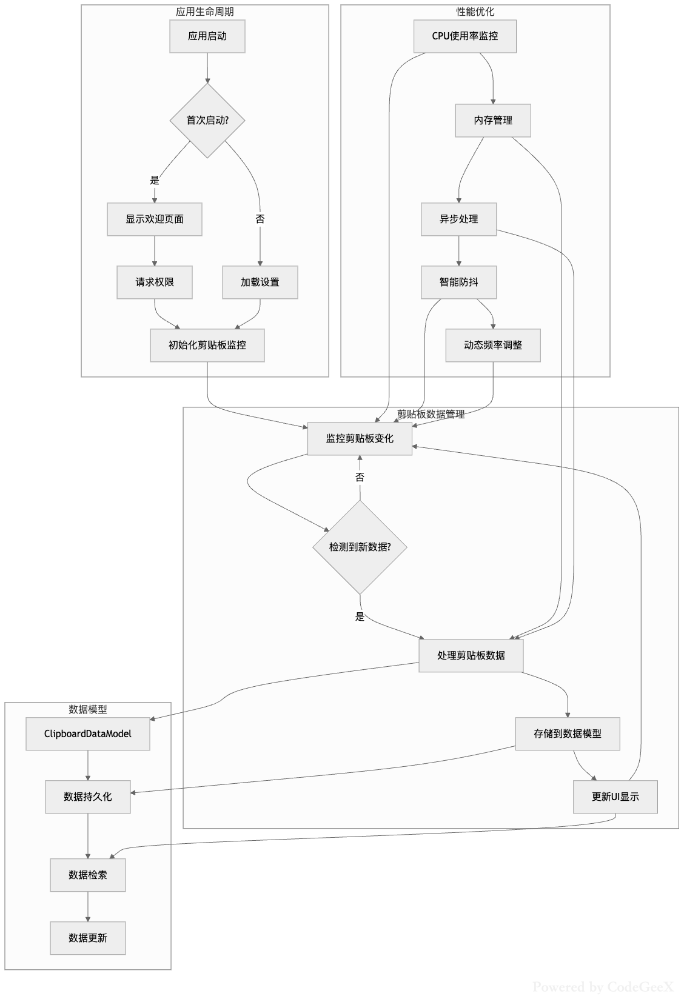

最新版1.2.4将会完全测试后再发布。功能更完善，性能更稳定  ——2025/9/6

<div align="center">
  
  <h1>OneClip</h1>
  <p><strong>简洁专业的 macOS 原生剪贴板管理器</strong></p>
  <p>🚀 高效 • 🎨 美观 • ⚡ 快速 • 🔒 安全</p>
</div>

---

## ✨ 产品亮点

OneClip 是一款专为 macOS 设计的高性能剪贴板管理器，采用 100% 原生 SwiftUI 技术栈构建，为用户提供无缝的剪贴板管理体验。



### 🎯 核心特性

- **📋 智能剪贴板管理**
  - 自动捕获并保存剪贴板历史记录
  - 支持文本、图片、文件等多种数据类型
  - 智能分类和快速搜索功能

- **🗂️ 全格式文件支持**
  - 真实文件复制粘贴，非路径文本
  - 支持图片、视频、音频、文档等格式
  - 保持文件完整性和元数据

- **⌨️ 全局快捷键**
  - `Cmd+Ctrl+V` 快速唤起主界面
  - 无需鼠标操作，提升工作效率
  - 可自定义快捷键组合

- **🎯 状态栏深度集成**
  - 左键点击：快速粘贴最新内容
  - 实时显示剪贴板状态

- **🔧 灵活的界面控制**
  - 可选择隐藏/显示 Dock 图标
  - 支持后台运行模式
  - 自适应系统主题

- **🎨 现代化原生界面**
  - 100% SwiftUI 构建
  - 遵循 macOS 设计规范
  - 流畅的动画和交互效果

## 🏗️ 技术架构

### 核心技术栈

- **前端框架**: SwiftUI (iOS 14.0+)
- **开发语言**: Swift 5.0+
- **数据存储**: Core Data
- **系统集成**: Carbon Framework (全局快捷键)
- **权限管理**: Accessibility API
- **构建工具**: Xcode 15+

### 架构设计

```
            ┌─────────────────────────────────────────┐
            │                OneClip                  │
            ├─────────────────────────────────────────┤
            │     SwiftUI Views & ViewModels          │
            ├─────────────────────────────────────────┤
            │  ClipboardManager | SettingsManager     │
            │  HotkeyManager    |  WindowManager      │
            ├─────────────────────────────────────────┤
            │      Core Data | Carbon Framework       │
            ├─────────────────────────────────────────┤
            │           macOS System APIs             │
            └─────────────────────────────────────────┘
```

### 核心组件

- **ClipboardManager**: 剪贴板监控和数据管理
- **HotkeyManager**: 全局快捷键处理
- **WindowManager**: 窗口状态和显示控制
- **SettingsManager**: 用户偏好设置管理
- **FeedbackManager**: 用户反馈和通知系统

## 📦 安装说明

### 系统要求

- **操作系统**: macOS 12.0或更高版本
- **处理器**: Apple Silicon (M1/M2/M3) 或 Intel x64
- **内存**: 最低 4GB RAM

### 快速安装


#### 1. **下载应用**
【1】请到 [Release 页面](https://github.com/Wcowin/OneClip/releases) 下载最新版本的 OneClip。

【2】打开终端执行下面这句：
```sudo xattr -rd com.apple.quarantine /Applications/OneClip.app```

输完密码后回车↩︎，再次打开**OneClip** 即可。Enjoy it～

---
如果遇到打不开或者提示已经损坏：请参考 [Mac电脑安装软件报错解决办法汇总](https://mp.weixin.qq.com/s/qjSx09tqNq1KfVug2WtQFg)  
  
如果嫌麻烦，也可以下载[macos小助手进行快速操作。](https://pan.quark.cn/s/f2302b6789b0)

---

#### 2. **本地构建应用**（暂未开源）
   ```bash
   # 使用快速构建脚本
   ./build.sh
   
   # 或手动构建
   xcodebuild -project Maccopy.xcodeproj -scheme OneClip -configuration Release build
   ```


### 权限配置

首次启动时，OneClip 需要以下系统权限：

1. **辅助功能权限**（必需）
   - 系统偏好设置 → 安全性与隐私 → 隐私 → 辅助功能
   - 添加 OneClip 并启用

2. **完全磁盘访问权限**（可选，用于文件操作）
   - 系统偏好设置 → 安全性与隐私 → 隐私 → 完全磁盘访问
   - 添加 OneClip 并启用

## 🚀 使用指南

### 基础操作

1. **启动应用**
   - 双击 `OneClip.app` 启动
   - 应用将在状态栏显示图标

2. **快速访问**
   - 按 `Cmd+Ctrl+V` 打开主界面
   - 点击状态栏图标快速粘贴

3. **内容管理**
   - 复制任何内容，自动保存到历史
   - 在主界面搜索和浏览历史记录
   - 点击任意项目即可粘贴

### 高级功能

- **分类筛选**: 按文本、图片、文件等类型筛选
- **搜索功能**: 快速查找历史内容
- **批量操作**: 清空历史、删除特定项目
- **设置自定义**: 调整快捷键、界面偏好等

## ⚙️ 配置选项

### 快捷键设置

- **主窗口呼出**: `Cmd+Ctrl+V`
- **快速粘贴**: 系统默认 `Cmd+V`
- **菜单显示**: 状态栏左键点击

### 界面设置

- **Dock 图标**: 自动显示/隐藏
- **启动模式**: 开机自启动选项
- **主题适配**: 自动跟随系统主题

### 存储设置

- **历史数量**: 可设置最大保存条目数
- **数据清理**: 定期清理过期内容
- **文件处理**: 大文件存储策略

## 🔧 开发构建(暂未开源)

### 开发环境(暂未开源)

```bash
# 环境要求
Xcode 15.0+
macOS 14.0+
Swift 5.9+
```

### 构建流程(暂未开源)

```bash
# 1. 克隆项目
git clone [项目地址]
cd Maccopy

# 2. 打开项目
open Maccopy.xcodeproj

# 3. 选择 OneClip scheme
# 4. 构建并运行 (Cmd+R)

# 或使用命令行构建
./build.sh
```

### 项目结构(暂未开源)

```
Maccopy/
├── Maccopy/                    # 主要源代码
│   ├── OneClipApp.swift       # 应用入口
│   ├── ContentView.swift      # 主界面
│   ├── ClipboardManager.swift # 剪贴板管理
│   ├── HotkeyManager.swift    # 快捷键管理
│   ├── WindowManager.swift    # 窗口管理
│   ├── SettingsManager.swift  # 设置管理
│   └── Assets.xcassets/       # 资源文件
├── build.sh                   # 构建脚本
├── dist/                      # 构建输出
└── README.md                  # 项目说明
```




## 📊 性能特性

- **内存占用**: 运行时约 20-30MB
- **CPU 使用**: 空闲时 < 15%
- **启动时间**: < 1 秒
- **响应速度**: 快捷键响应 < 100ms
- **存储效率**: 智能压缩，节省磁盘空间

## 🐛 常见问题

### Q: 快捷键不工作？
A: 请确保**已授予辅助功能权限**，并重启应用。

### Q: 无法复制文件？
A: 请检查完全磁盘访问权限是否已启用。

### Q: 应用无法启动？
A: 请确认系统版本为 macOS 12.0+，并检查应用完整性。

### Q: 状态栏图标消失？
A: 重启应用或检查系统状态栏设置。

### Q: 内存占用过高？
A: 可在设置中调整历史记录数量限制和检测间隔。

## 📈 版本历史

### v1.0.0 (当前版本)
- ✨ 初始版本发布
- 📋 基础剪贴板管理功能
- ⌨️ 全局快捷键支持
- 🎯 状态栏集成
- 🎨 SwiftUI 原生界面

### 即将推出
- [x] 🏷️ 标签功能
- [x] 多格式文件支持
- [ ] 收藏功能
- [ ]  🔄 iCloud 同步支持
- [ ] 📱 iOS 版本开发
- [ ] 🔌 插件系统
- [ ] 🌐 多语言支持

## 👨‍💻 作者信息

- **开发者**: [Wcowin](https://wcowin.work/blog/Mac/sunhuai/)
- **联系邮箱**: [wcowin@qq.com](mailto:wcowin@qq.com)
- **最后更新**: 2025年8月11日

## 🤝 反馈与支持

如果您在使用过程中遇到问题或有改进建议，欢迎通过以下方式联系：
  
- 📧 邮件: [wcowin@qq.com](mailto:wcowin@qq.com)
- 🐛 问题反馈: [GitHub Issues](https://github.com/Wcowin/OneClip/issues)
- 💡 功能建议: [GitHub Discussions](https://github.com/Wcowin/OneClip/discussions)

---

<div align="center">
  <p><strong>OneClip

  一个简单专业的剪贴板管理工具</strong></p>
  <p>© 2025 Wcowin. All rights reserved.</p>
</div>
